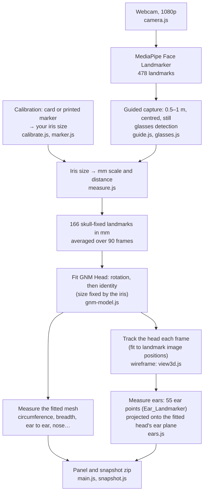

# headSize-gnm — Head, Face and Ear Measurement from a Webcam

Estimates the head, face and ear dimensions that matter for fitting glasses, earbuds, headphones and hats. It runs in the browser from an ordinary webcam. MediaPipe tracks the face, and Google's [GNM Head](https://github.com/google/GNM) 3D head model is fitted to it to predict what the camera can't see. The ears are measured from side views.

Everything runs locally. No video or measurement leaves the device unless you save a snapshot.

**Demo:** https://shameem4.github.io/headSize-gnm/ · Article: [Measuring the whole head privately in the browser](https://www.linkedin.com/pulse/measuring-whole-head-privately-browser-shameem-hameed-ep0mc/) · Companion face-only demo: [headSize](https://github.com/shameem4/headSize) ([article](https://www.linkedin.com/pulse/measuring-human-face-privately-browser-shameem-hameed-51okc/))

> **Status: research prototype.** The simulation results are best cases, and real-world checks so far cover **one person**. Treat the numbers as coarse sizing (S/M/L-style), not as a fitting-room measurement.

## Using it

1. **Stand 0.5–1 m from the camera** with your head in the oval, then hold still while the line runs around your head. The head is fitted from 90 frames.
2. **Calibrate (recommended):**
   - Use **Calibrate with a card** (any bank-card-sized card, held flat against your forehead) or **Calibrate with printed marker** (print [marker.html](marker.html) at 100% / "Actual size").
   - This measures your own iris size, which sets the scale for everything else. Without it, the page assumes an average 11.7 mm iris.
   - **Calibrate and measure in the same state: both with glasses or both without.** Glasses change how big your iris looks. On our test this caused a 3–4% scale error when the states didn't match.
3. **Measure ears (optional):** turn your head about 50–60° to one side, then the other.
   - Spoken prompts and ticks guide you, since you can't see the screen while turned.
   - Only frames where the ear is seen within 20° of square are used.
4. **Save snapshot:** downloads one zip containing:
   - the head image and measurement table;
   - the raw frame;
   - a JSON of all values;
   - the calibration image, if you calibrated this session;
   - the ear record (both ears' points and crops), if you measured ears.

   Enter your name first if you want it in the file names.

Hover over any measurement or button for a description.

## What it measures

| Group | Measurements | Source |
|---|---|---|
| **Glasses** | temple width, eye to ear (arm length), IPD (far), bridge width, pad width, nose bridge projection and height, nose bridge low / medium / high | fitted head; IPD measured directly between the pupils |
| **Earbuds** | ear length and width, concha height and width, tragus to antitragus | side views ("Measure ears") |
| **Headphones** | ear to ear, straight and over the head | fitted head |
| **Head** | circumference, US hat size, length, breadth, face width, eye width | fitted head |

The nose bridge category comes from bridge projection, split into thirds of the GNM Head population. It isn't an industry standard.

## How it works



- **Scale:** the iris is assumed to be 11.7 mm across, or your calibrated size. Its width in pixels gives mm per pixel at the eyes and, with the camera's focal length, the distance.
- **Fit:**
  - GNM Head is fitted to the averaged, skull-fixed landmarks through the MediaPipe↔GNM correspondence and reference cloud from [XR Blocks](https://github.com/google/xrblocks/tree/main/samples/avatar_lab/gnm). The reference cloud absorbs MediaPipe's depth bias.
  - The size comes from the iris; GNM supplies only the shape. GNM's own guess at size, from face proportions, was about 5% off on a real face.
- **Measurements** are taken on the fitted mesh, tape-measure style. Examples: circumference is the widest loop in a band above the brows; temple width is across the model's temple region.
- **Ears:**
  - [Ear_Landmarker](https://github.com/shameem4/Ear_Landmarker) finds 55 ear points (iBUG numbering) on a crop around the head. Each point is projected onto the fitted head's ear plane, which corrects for distance and viewing angle.
  - **Length** runs from the top of the rim (helix) to the lowest point of the lobe, along the ear's own axis.
  - **Width** runs across that axis, from where the top of the ear joins the head to the back of the rim. That's also how to check it with a ruler.

## Accuracy

The **±** shown next to each value is:
- **for the head, glasses and headphone measurements:** the typical error from simulation ([experiments](experiments/)), taking the scale from an average iris;
- **once you're calibrated:** the shape error plus 1.5% for the calibration;
- **for the ear measurements:** the spread between frames in that run, which understates the real uncertainty.

Typical error (RMSE) from simulation:

| Measurement | Spread between people (SD) | Average iris | Calibrated (shape only) |
|---|---|---|---|
| Circumference | 26.5 | 22.7 | 8.1 |
| Length / breadth | 10.4 / 8.2 | 7.8 / 6.6 | 3.4 / 2.7 |
| Temple width | 8.5 | 6.1 | 1.4 |
| Eye to ear | 6.9 | 6.1 | 4.5 |
| Ear to ear, straight / over head | 8.2 / 14.5 | 6.2 / 13.0 | 1.8 / 6.4 |
| Nose bridge projection | 4.1 | 0.9 | 0.9 |

All values are in mm. The simulation draws its test heads from GNM itself, so it's a best case.

**Real checks, one person:**

| | Demo | Reference |
|---|---|---|
| IPD | 68.3–68.6 mm (calibrated, matching glasses state) | 68 mm (lens prescription) |
| Head circumference | 558–583 mm over valid runs | ~580 mm (tape) |
| Right ear length | 66.6–70.5 mm | ~68 mm (ruler) |
| Right ear width | 37.5–39.8 mm | >36 mm (ruler, measured as above) |

The ear values are corrected for each run's scale error.

**Known limits:**
- **Validation:** only one person has been checked; more people with tape measurements are the most useful next step.
- **Hair:** GNM heads are bald, so allow extra for hair on hat sizes.
- **Earbuds:** ear canal size, which decides earbud tip size, can't be seen from outside. The ear measurements suit earbud shells and ear-size categories, not tips.
- **Ear model quirks:**
  - Ear_Landmarker sometimes places the front of the rim (point 0) on the face.
  - Its lobe arc can run onto the cheek; length stops at the lobe's lowest point for this reason.
  - Ear width varied by about ±1.5 mm between runs.
- **Ideas tried and dropped:** a Face-ID-style multi-view "sweep" fit, and ear sizes predicted from the face alone. See [experiments/README.md](experiments/README.md).

## Privacy

- **Local processing:** video is processed in the browser. Models and libraries load from CDNs; your images don't go anywhere.
- **Card calibration:** the card is shown and saved pixelated except at its edges. Snapshots are blocked while calibrating, so an unpixelated card can't be saved.
- **Stored in the browser:** your calibrated iris size (localStorage), and nothing else.

## Running locally

No build step. ES modules need a web server:

```bash
python -m http.server 8000
```

Then open http://localhost:8000 and allow camera access.

## Files

```text
index.html, style.css, gnm.css   UI
main.js                          Capture flow, fit, panel, calibration, ear step, snapshots, audio
config.js                        Camera, iris and landmark settings
camera.js                        Webcam selection, MediaPipe setup
measure.js                       Iris scale, distance, 3D landmarks, IPD
gnm-model.js                     GNM Head: load, fit, pose tracking, measurements
gnm_head_fit.bin                 Trimmed GNM Head (100 shape components), from experiments/export_web.py
view3d.js                        Three.js wireframe head over the video
guide.js, glasses.js             Capture guide, glasses detection
calibrate.js                     Card calibration: automatic edge finding, pixelation
marker.js, marker.html           Printed ArUco marker calibration
ears.js, ear/                    Ear measurement; Ear_Landmarker models (BlazeFace, BlazeEar, landmarks; ONNX) and inference
snapshot.js                      Snapshot images and zip
experiments/                     Simulations, real-data findings and the web export (Python)
```

## Credits and licences

The code is licensed under the [Apache License 2.0](LICENSE): commercial use is allowed, provided the licence and the [NOTICE](NOTICE) file go with any copy. **The exception is the trained ear models** ([ear/LICENSE.md](ear/LICENSE.md)):
- **`EarLandmarker_web.onnx`** is research use only, because it was trained mostly on non-commercial data (iBUG ears, and FFHQ images via AudioEar2D).
- **`BlazeEar_web.onnx`** is unverified for commercial use. Its training datasets carry mixed terms.

For commercial use, drop the ear step or retrain the ear models on commercially licensed data.

It includes or loads:

- **[GNM Head](https://github.com/google/GNM)** (Google, Apache-2.0). `gnm_head_fit.bin` is a trimmed export of it.
- **MediaPipe↔GNM correspondence** from [XR Blocks](https://github.com/google/xrblocks) (Google, Apache-2.0), derived from [gnm-webcam-puppet](https://github.com/edualvarado/gnm-webcam-puppet).
- **[Ear_Landmarker](https://github.com/shameem4/Ear_Landmarker)** and **[BlazeEar](https://github.com/shameem4/BlazeEar)** (code Apache-2.0): the 55-point ear landmark model (research use only), the BlazeEar ear detector (training data terms unverified), and MediaPipe's BlazeFace face detector (Apache-2.0).
- **Loaded from CDNs:**
  - [MediaPipe Tasks Vision](https://github.com/google-ai-edge/mediapipe) (Apache-2.0)
  - [three.js](https://threejs.org) (MIT)
  - [ONNX Runtime Web](https://github.com/microsoft/onnxruntime) (MIT)
  - [js-aruco2](https://github.com/damianofalcioni/js-aruco2) (MIT)
  - [fflate](https://github.com/101arrowz/fflate) (MIT)
