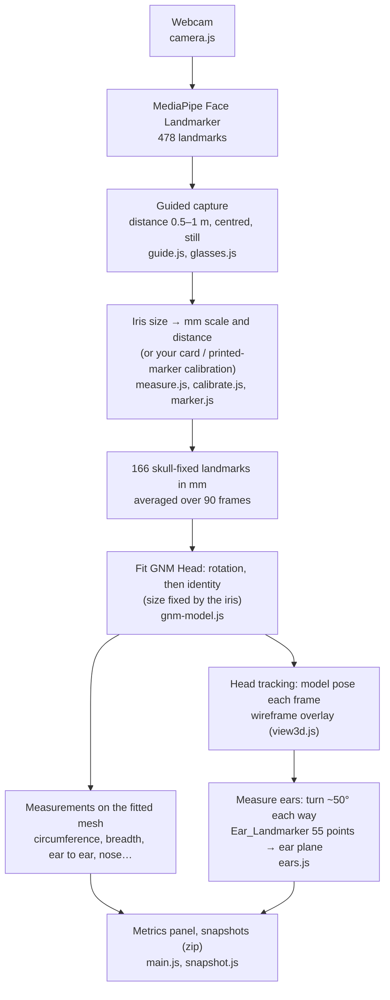

# headSize-gnm — Head Measurement with a Fitted 3D Head Model

Estimates head and face dimensions for hats, glasses, headphones and earbuds from a webcam, in the browser. MediaPipe tracks the face, and Google's [GNM Head](https://github.com/google/GNM) is fitted to it to predict the parts the camera can't see. Everything runs locally; no video leaves the device.

Demo: https://shameem4.github.io/headSize-gnm/ · Companion face-only demo: [headSize](https://github.com/shameem4/headSize)

## What it measures

Hover over any measurement in the app for a description.

- **Glasses:**
  - temple width, eye to ear (arm length)
  - IPD (measured directly from the pupils)
  - bridge and pad width
  - nose bridge projection and height, with a low / medium / high category
- **Headphones:** ear to ear, straight and over the head
- **Earbuds:** ear length and width, concha height and width, and the tragus-to-antitragus gap. These are measured from side views with "Measure ears".
- **Head (and hat):** circumference (with a US hat size), length, breadth, face width, eye width

Each value shows a typical error. For most values it comes from simulation (see [experiments](experiments/)); for the ear measurements it's the frame-to-frame spread. The model's heads are bald, so allow extra for hair.

## How it works



1. **Scale** comes from the iris, assumed to be 11.7 mm across. Calibrating once gives your own iris size: hold a bank-card-sized card or the [printed marker](marker.html) to your forehead. The card's face is pixelated, and its edges are found automatically.
2. **Fit:** GNM Head is fitted to the averaged, skull-fixed MediaPipe points with the size held fixed. It then predicts the whole head, including circumference and the ears' positions. The fit's reference cloud (from [XR Blocks](https://github.com/google/xrblocks/tree/main/samples/avatar_lab/gnm)) absorbs MediaPipe's depth bias.
3. **Tracking:** after measuring, the head is tracked by fitting the model to where the landmarks appear in the image, not to MediaPipe's depth.
4. **Ears:** with the head turned, [Ear_Landmarker](https://github.com/shameem4/Ear_Landmarker) finds 55 ear points (iBUG numbering). Each point is projected onto the fitted head's ear plane to get millimetres, corrected for the viewing angle.

**Checked on one real person:**
- IPD 68.3–68.6 mm against 68 mm from a lens prescription, after calibration.
- Head circumference 558–576 mm against ~580 mm by tape.
- Right ear 67.4 × 33.1 mm against ~68 × 33 mm by ruler.

This is encouraging, but it's one person. See [experiments/README.md](experiments/README.md) for the simulations, the limits, and ideas that didn't work, including a multi-view "sweep" fit.

## Running locally

No build step. ES modules need a web server:

```bash
python -m http.server 8000
```

Then open http://localhost:8000 and allow camera access. The page asks for 1080p; at 1 m a 720p webcam sees the iris only ~12 px wide.

## Files

```text
index.html, style.css, gnm.css   UI
main.js                          Capture flow, fit, panel, snapshots, ear step
config.js                        Camera and landmark settings
camera.js                        Webcam selection, MediaPipe setup
measure.js                       Iris scale, distance, 3D back-projection, direct IPD
gnm-model.js                     GNM Head: load, fit, pose tracking, measurements
gnm_head_fit.bin                 Trimmed GNM Head (100 components), from experiments/export_web.py
view3d.js                        Three.js wireframe head over the video
guide.js, glasses.js             Capture guide (distance, centring), glasses detection
calibrate.js                     Card calibration: edge finding, privacy pixelation
marker.js, marker.html           Printed ArUco marker calibration
ears.js, ear/                    Ear measurement; Ear_Landmarker models (ONNX)
snapshot.js                      Snapshot images and zip
experiments/                     Simulations and findings (Python)
```

## Credits and licences

This project is licensed under [CC BY-NC 4.0](LICENSE) (non-commercial). It includes or loads:

- **[GNM Head](https://github.com/google/GNM)** (Google, Apache-2.0). `gnm_head_fit.bin` is a trimmed export of its head model. See [LICENSE-APACHE-2.0.txt](LICENSE-APACHE-2.0.txt).
- **MediaPipe↔GNM landmark correspondence** from [XR Blocks](https://github.com/google/xrblocks) (Google, Apache-2.0), derived from [gnm-webcam-puppet](https://github.com/edualvarado/gnm-webcam-puppet).
- **[Ear_Landmarker](https://github.com/shameem4/Ear_Landmarker)** (BlazeEar + 55-point model). Trained on iBUG ears and AudioEar data, which are for non-commercial research only.
- **Loaded from CDNs:**
  - [MediaPipe Tasks Vision](https://github.com/google-ai-edge/mediapipe) (Apache-2.0)
  - [three.js](https://threejs.org) (MIT)
  - [ONNX Runtime Web](https://github.com/microsoft/onnxruntime) (MIT)
  - [js-aruco2](https://github.com/damianofalcioni/js-aruco2) (MIT)
  - [fflate](https://github.com/101arrowz/fflate) (MIT)
